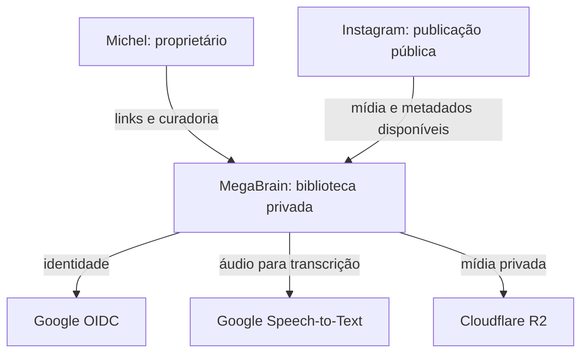
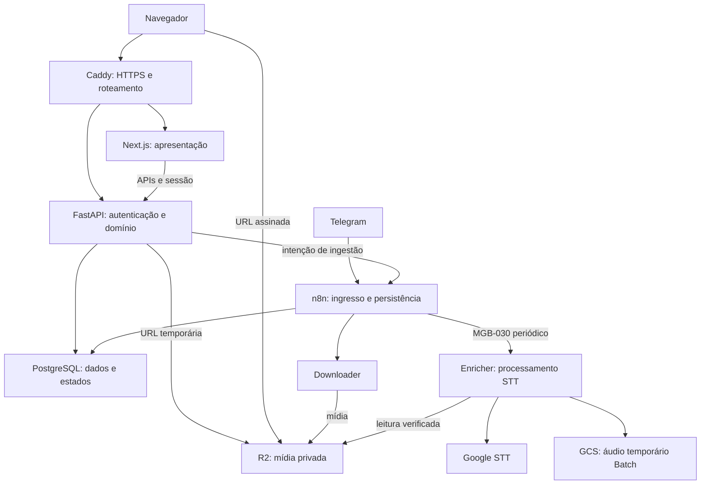
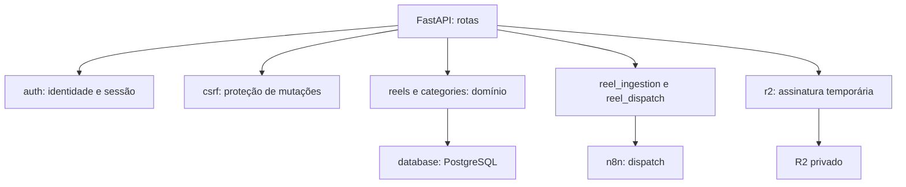

# Arquitetura do MegaBrain — arc42 e vistas C4

Baseline documental: fontes do GitHub em b38458d9845b0cda4dea65dcf618750b6cc4cbec.
Decisões de direção confirmadas por Michel em 2026-10-01; consolidação em 2026-10-02.
Esta página descreve a arquitetura do código e os snapshots disponíveis. Não é
uma nova auditoria de produção. [CURRENT_STATE.md](CURRENT_STATE.md) identifica
capacidades comprovadas e pendências; [CONTEXT.md](CONTEXT.md) orienta a retomada.

## 1. Introdução e objetivos

O produto atual é uma biblioteca Web privada de Reels: registrar links públicos,
baixar mídia, preservar caption e metadados, solicitar transcrição e fazer
curadoria manual. A visão futura inclui análise IA, categorização automática e
outras fontes, sem presumir que essas capacidades já existem.

O ambiente de engenharia deve desenvolver e manter esse e outros sistemas com
tarefas delimitadas, contexto recuperável, preview, revisão e deploy rastreáveis.
A meta é preservar decisões e evidências entre sessões, com poucas intervenções
humanas e uso limitado da assinatura. O perfil atual é de proprietário único.

| Objetivo de qualidade | Resultado esperado |
|---|---|
| Continuidade | Outra sessão identifica objetivo, decisões, limites e próximo passo a partir do Git e da tarefa. |
| Fidelidade de produto | A UI entregue corresponde à proposta navegável e às imagens anotadas aceitas. |
| Isolamento | Falha em download/STT fica registrada no item; trabalho de engenharia não usa dados de produção. |
| Eficiência | Scripts e CI fazem verificações repetíveis; modelos planejam, implementam e interpretam falhas. |
| Rastreabilidade | QA, revisão e recibo de deploy identificam o mesmo candidato e artefato. |

## 2. Restrições

- Reaproveitar VPS, PostgreSQL, R2, Google STT, n8n, GitHub e a assinatura existentes.
- Nenhuma nova plataforma paga é requisito desta fundação.
- GitHub é a fonte de verdade do código, documentação e evidências versionadas.
- Agentes publicam somente agent/*; D017 e AGENTS.md restringem merge e produção.
- FastAPI continua autoridade de autenticação, domínio e dados; Next.js apresenta.
- R2 permanece privado; sessão opaca do proprietário e CSRF continuam obrigatórios.
- AP0 mantém admissão, recursos, budgets, gates e checkpoints das tarefas AP0.
- Direção escolhida e implantação são estados diferentes. D022 não desativa gates.
- Preview na VPS é a direção escolhida; URL, limites e isolamento precisam de prova.
- Inglês, coleta em massa dos salvos e análise automática são objetivos pendentes.

## 3. Contexto e escopo — C4 nível 1

### Produto e dependências externas

O ingresso atual é manual por Telegram ou Web. Isso não equivale a importar
automaticamente toda a lista de salvos. O acesso a publicação pública não garante
que todo link seja baixável ou que todos os metadados estejam disponíveis.

### Engenharia

Michel define intenção e prioridades. Um responsável prepara o contrato.
Paperclip acompanha tarefa e execuções; Codex e Hermes recebem escopos.
GitHub guarda revisões e PRs; AP0 controla as execuções que usam seu contrato.
Conteúdo dos Reels fica em PostgreSQL/R2, separado do contexto de engenharia.

Acesso da Web ao cockpit tem código de ticket em
[platform_access.py](../services/web/app/platform_access.py). A existência desse
código não demonstra sozinha exchange, sessão ou acesso de API no Paperclip.

## 4. Estratégia de solução

Manter um responsável por tarefa e uma implementação ativa inicialmente.
Escolher o executor pela necessidade: Codex para código; Hermes para integrações,
pesquisa e automações. A plataforma acompanha; o agente responsável planeja.

Contexto entra por [CONTEXT.md](CONTEXT.md), decisões aceitas e pacote da tarefa.
CocoIndex poderá localizar trechos depois de medir falhas da busca simples.
Dados da biblioteca só entram no contexto quando forem pertinentes à tarefa.

Usar proposta navegável e imagens anotadas antes de reformular a UI. Manter
preview e testes separados da produção. Automatizar publicação de baixo risco
somente após o piloto e uma capability/política de produção validada.

## 5. Blocos de construção — C4 níveis 2 e 3

### Containers do produto

MGB-030, no n8n, é a autoridade periódica de processamento e persistência dos
resultados de transcrição. Enricher responde processamento/reconciliação;
não deve ser descrito como escritor direto do PostgreSQL sem fonte de código.
Caption original permanece distinta do texto transcrito.

| Bloco | Responsabilidade | Fonte |
|---|---|---|
| Next.js | App Shell, biblioteca, detalhe, categorias e apresentação de estados | [apps/web](../apps/web) |
| FastAPI | OIDC, sessão, CSRF, APIs, curadoria e assinatura de mídia | [services/web](../services/web) |
| n8n | Validar ingresso, dispatch, download e consumidor periódico | [workflows](../workflows) |
| Downloader | Recuperar e verificar mídia, subir para R2 | [main.py](../services/downloader/app/main.py) |
| Enricher | Extração de áudio, STT, Batch/reconciliação e cleanup após persistência terminal | [main.py](../services/enricher/app/main.py) |
| PostgreSQL/R2 | Dados estruturados/estados e mídia pesada privada | [Compose](../infra/docker-compose.yml) |

### Componentes da Web — C4 nível 3

Fontes: [main](../services/web/app/main.py),
[auth](../services/web/app/auth), [csrf](../services/web/app/csrf.py),
[reels](../services/web/app/reels.py), [categories](../services/web/app/categories.py),
[ingestion](../services/web/app/reel_ingestion.py),
[dispatch](../services/web/app/reel_dispatch.py), [r2](../services/web/app/r2.py).
O frontend usa módulos de API e componentes de estado em apps/web/src.
O Enricher separa mídia, acesso R2, GCS temporário e adapters STT em services/enricher/app.

### Engenharia: containers e autoridades

| Componente | Autoridade e fronteira |
|---|---|
| Paperclip e adapter nativo | Pedido, responsável, acompanhamento e runs nativos; vincula fontes no Git. |
| Control Plane AP0 | Ledger canônico de tarefas AP0, leases, gates, budgets, checkpoints e auditoria. |
| Hermes coordinator instalado | Componente limitado pelo contrato AP0 existente; provisionamento pendente no snapshot. |
| Worker Manager | Recursos somente após admissão e registro de identidade forte. |
| Codex / Hermes | Execução delimitada; não são bancos canônicos nem aprovadores humanos. |
| CI GitHub | Verificações isoladas do candidato, sem segredos de produção. |
| Capability de deploy | Operação delimitada e auditável, sob os gates atuais. |

Não há migração automática de registros. Para execução AP0, preservar task_id,
checkpoint_id, revisão e API canônicos. Para execução nativa, identificar o
run/issue do Paperclip e o snapshot Git. Não criar um segundo escritor para o
mesmo registro. Os contratos existentes continuam referenciados em
[CONTEXT.md](CONTEXT.md).

## 6. Vistas de runtime

### Ingresso e download

Telegram/MGB-001 ou Web autenticada registra o link; n8n conduz ingresso e
download. Downloader grava mídia privada; o workflow persiste referências.
O estado final normal do download é downloaded/not_requested. Download não
autoriza transcrição, análise IA ou processamento em massa.

### Transcrição sob demanda

O proprietário pede Transcrever; FastAPI enfileira not_requested ou failed.
MGB-030 reivindica o trabalho e conduz queued → processing → completed/failed.
STT usa o caminho síncrono dentro do contrato seguro ou Batch com GCS temporário.
A operação Batch e sua reconciliação são duráveis; cleanup ocorre depois de
persistência terminal. A baseline documentada valida pt-BR; inglês precisa de
discovery e evidência próprios.

### Consulta privada

Google OIDC identifica o proprietário; FastAPI emite sessão local opaca,
consulta o domínio e assina mídia temporária após autorização. O navegador
reproduz R2 sem receber credenciais. Caddy roteia; Next.js apresenta.

### Desenvolvimento e retomada escolhidos

Responsável → contrato/pacote → executor permitido → checkpoint → preview/QA
→ revisor em outra sessão → candidato final → capability de publicação
→ recibo/runtime → estado final na tarefa. Ver
[ORCHESTRATION_ROLLOUT.md](ORCHESTRATION_ROLLOUT.md).
Este é o fluxo alvo; o piloto completo ainda não foi executado.

## 7. Vista de implantação

A configuração versionada é [infra/docker-compose.yml](../infra/docker-compose.yml);
o roteamento é [infra/Caddyfile](../infra/Caddyfile).
Caddy publica 80/443. Frontend:3000 e Web:8000 usam rede interna.
PostgreSQL, n8n, downloader, enricher e Paperclip dependem da mesma VPS;
bases/logins distintos não eliminam falha compartilhada de host ou PostgreSQL.

Paperclip usa o fork montado e um processo MCP separado no Compose.
AP0 Control Plane e Hermes coordinator são serviços systemd observados no
snapshot, distintos do runtime Docker do produto. O estado active/running
não comprova que o executável de uma execução de agente está provisionado.

Produção permanece fora do workspace do executor. Preview alvo usa workspace,
processo/lease, dados de teste, autenticação e recursos separados; sua URL deve
identificar o candidato. Criar rota pública, DNS ou alterar Caddy requer a
operação autorizada correspondente. TTL expirado não autoriza apagar recursos.

## 8. Conceitos transversais

- Identidade: sessão opaca Web; humano, serviço e agente distintos em auditoria.
- Segurança: least privilege, CSRF, R2 privado e capabilities delimitadas.
- Contexto: fontes versionadas; checkpoint descreve o último estado persistido.
- Estado: tarefa, processo, recurso, revisão e release têm lifecycles distintos.
- Falhas: download/STT falho não significa falha de leitura da biblioteca;
  indisponibilidade do host/banco compartilhado ainda pode atingir vários serviços.
- Quota: preservar progresso e aguardar; não iniciar tentativas sem admissão.
- Custos: scripts/CI geram testes e artefatos; modelos recebem resumos e evidências pertinentes.
- Manutenção: a mesma PR atualiza documentos e decisões afetados; revisor confere.
- Retries: duas hipóteses distintas por bloqueio; registrar evidências antes de escalar.
- DDD: usar vocabulário do produto; não introduzir padrões enterprise sem necessidade.

## 9. Decisões arquiteturais

[DECISIONS.md](DECISIONS.md) preserva contexto, decisão, alternativas e consequências.
D020/D021 definem apresentação e autenticação atuais; D012/D017 mantêm autoridade
de produção/Git; D022 registra o modelo de orquestração escolhido.
Implementação pendente não deve ser descrita como capability instalada.

## 10. Requisitos de qualidade e cenários

| Cenário | Evidência de aceite |
|---|---|
| Sessão nova retoma trabalho | Reconstrói objetivo, limites, decisões e próximo passo sem chat anterior. |
| HEAD ou branch diverge do checkpoint | Detecta e reconcilia; não reseta ou adota checkout alheio. |
| Provider perde quota | Checkpoint durável, estado de bloqueio e retomada após novo preflight. |
| STT falha num Reel | Estado/erro do item persistido; biblioteca continua consultável se backend/banco estão disponíveis. |
| Mudança de UI | Referência aceita + preview desktop/mobile + verificação de estados e interação. |
| Candidato muda após review | Evidência anterior fica histórica; revalidar o candidato final pertinente. |
| Publicação | Recibo identifica commit, artefato, ambiente, checks e reversão; leitura runtime confirma. |

Critérios específicos de tempo, memória e retenção serão medidos e registrados
no piloto; não há SLO numérico comprovado nesta baseline.

## 11. Riscos e dívida técnica

- AP0 coordinator: executável e config do perfil separados não encontrados no
  snapshot de configuração; tarefa de provisionamento necessária.
- Encaminhamento MCP local_stdio do deploy falhou antes da capability na MEG-4;
  não confundir contorno validado com integração corrigida.
- Pacote/checkpoint não são automaticamente injetados em toda sessão nativa.
- Preview/Playwright foram experimentados fora da baseline; padronização pendente.
- UI_SYSTEM.md é histórico Jinja; descoberta visual atual ainda necessária.
- Serviços compartilham VPS/PostgreSQL; backup/restore e observabilidade precisam de prova.
- Inglês, ingestão em massa e análise automática não estão validados.
- CI e testes não demonstram sozinhos UX, integração real ou produção.
- Auto deploy escolhido ainda precisa de critérios, capability e recuperação validados.

## 12. Glossário

| Termo | Significado no MegaBrain |
|---|---|
| Reel | Item de biblioteca originado de uma publicação. |
| Mídia | Vídeo/áudio armazenado, distinto de seus metadados. |
| Caption | Legenda textual original da publicação, preservada separadamente. |
| Transcrição | Texto reconhecido do áudio, com idioma, estado e proveniência. |
| Curadoria / categoria | Organização manual atual; classificação IA é evolução futura. |
| Task Contract / Packet | Especificação canônica e sua projeção compacta para a execução. |
| Checkpoint | Progresso persistido, fontes e próximo passo; não é a memória inteira da IDE. |
| Candidato | Revisão/artefato exatos submetidos a validação e review. |
| Preview | Runtime de teste identificado e delimitado por tarefa/revisão. |
| Recibo de deploy | Evidência de qual artefato foi publicado e verificado. |

Referências de representação: [arc42](https://arc42.org/overview/) e
[C4](https://c4model.com/diagrams). Foram usados para organizar as vistas;
a cobertura é do sistema observado, com lacunas explicitadas.
